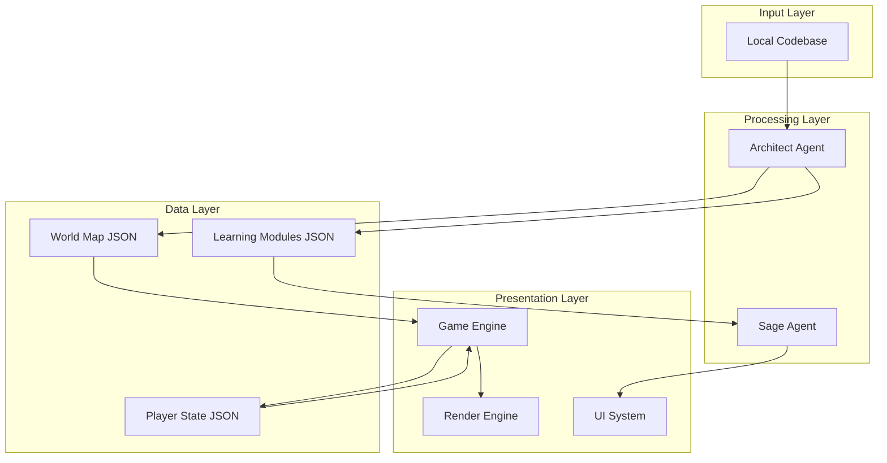

# Design Document: The Obsidian Ledger

## Overview

The Obsidian Ledger is a technical learning platform that transforms codebases into interactive 2D retro pixel RPG experiences. The system consists of three main components: (1) the Architect Agent that parses codebases and generates JSON-based world maps, (2) the Sage Agent that provides AI-powered tutoring and puzzle generation, and (3) a frontend game engine that renders the pixel art world and handles player interactions.

The architecture prioritizes modularity with clear separation between documentation processing, world generation, AI tutoring, and game rendering. The initial version focuses on local codebase parsing to minimize complexity while establishing the core learning experience.

## Architecture

### High-Level Architecture



### Component Responsibilities

1. **Architect Agent**: Parses codebase, extracts learning content, generates world map
2. **Sage Agent**: Provides contextual tutoring, generates coding puzzles, offers hints
3. **Game Engine**: Manages game state, player movement, zone transitions, collision detection
4. **Render Engine**: Draws pixel art sprites, tiles, and UI elements
5. **UI System**: Handles dialogue, code editor, progress display

### Data Flow

1. Player provides local codebase path
2. Architect Agent parses codebase and generates World Map JSON and Learning Modules JSON
3. Game Engine loads World Map JSON and initializes game state
4. Player navigates world, triggering zone transitions
5. When player interacts with Sage, UI System queries Sage Agent with current context
6. Sage Agent generates responses using Learning Modules JSON
7. Player progress is persisted to Player State JSON

## Components and Interfaces

### Architect Agent

**Purpose**: Parse local codebases and generate structured game world data.

**Input**:
- Codebase path (string)
- Configuration options (language filters, depth limits)

**Output**:
- World Map JSON file
- Learning Modules JSON file

**Core Functions**:

```
function parseCodebase(path: string, config: ParseConfig) -> ParsedCodebase
  // Recursively read files, filter by language, extract structure
  
function extractLearningContent(codebase: ParsedCodebase) -> LearningModule[]
  // Identify key concepts, functions, classes, patterns
  // Group related content into modules
  
function generateWorldMap(modules: LearningModule[]) -> WorldMap
  // Create zones for each module
  // Establish connections based on dependencies
  // Assign difficulty levels based on complexity
  
function exportToJSON(worldMap: WorldMap, modules: LearningModule[]) -> void
  // Write world-map.json and learning-modules.json
```

**World Map JSON Schema**:

```json
{
  "metadata": {
    "title": "string",
    "source": "string",
    "generatedAt": "timestamp"
  },
  "startZone": "zone-id",
  "zones": [
    {
      "id": "string",
      "name": "string",
      "description": "string",
      "position": {"x": "number", "y": "number"},
      "size": {"width": "number", "height": "number"},
      "tileMap": "2D array of tile IDs",
      "moduleId": "string",
      "difficulty": "number (1-5)",
      "prerequisites": ["zone-id"],
      "connections": [
        {
          "toZone": "zone-id",
          "direction": "north|south|east|west",
          "locked": "boolean"
        }
      ],
      "npcs": [
        {
          "id": "string",
          "type": "sage|helper",
          "position": {"x": "number", "y": "number"}
        }
      ]
    }
  ]
}
```

**Learning Modules JSON Schema**:

```json
{
  "modules": [
    {
      "id": "string",
      "title": "string",
      "description": "string",
      "concepts": ["string"],
      "codeExamples": [
        {
          "language": "string",
          "code": "string",
          "explanation": "string"
        }
      ],
      "puzzles": [
        {
          "id": "string",
          "title": "string",
          "description": "string",
          "starterCode": "string",
          "testCases": [
            {
              "input": "any",
              "expectedOutput": "any"
            }
          ],
          "hints": ["string"]
        }
      ]
    }
  ]
}
```

### Sage Agent

**Purpose**: Provide AI-powered tutoring and contextual assistance.

**Input**:
- Player query (string)
- Current module context (LearningModule)
- Player progress data (CompletedModules, AttemptedPuzzles)

**Output**:
- Response text (string)
- Suggested hints (string[])
- Related concepts (string[])

**Core Functions**:

```
function answerQuery(query: string, context: LearningModule) -> Response
  // Use LLM to generate contextual explanation
  // Reference code examples from module
  
function generateHint(puzzle: Puzzle, attemptCount: number) -> string
  // Provide progressively detailed hints
  // Avoid giving away complete solution
  
function evaluateSolution(code: string, testCases: TestCase[]) -> EvaluationResult
  // Execute code against test cases
  // Return pass/fail with feedback
```

**Integration**: The Sage Agent can be implemented using any LLM API (OpenAI, Anthropic, local models). The agent receives the learning module JSON as context and generates responses based on that structured data.

### Game Engine

**Purpose**: Manage game state, player movement, and game logic.

**State Management**:

```
interface GameState {
  player: {
    position: {x: number, y: number},
    currentZone: string,
    inventory: Item[],
    completedModules: string[],
    solvedPuzzles: string[]
  },
  worldMap: WorldMap,
  loadedZone: Zone,
  npcs: NPC[]
}
```

**Core Functions**:

```
function loadWorldMap(jsonPath: string) -> WorldMap
  // Parse world-map.json
  
function initializeGame(worldMap: WorldMap) -> GameState
  // Set player at start zone
  // Load initial zone data
  
function updatePlayerPosition(input: InputCommand, state: GameState) -> GameState
  // Handle movement input
  // Check collisions
  // Trigger zone transitions
  
function checkZoneTransition(position: Position, state: GameState) -> Zone | null
  // Detect if player crossed zone boundary
  // Verify prerequisites are met
  
function handleInteraction(target: NPC | Object, state: GameState) -> InteractionResult
  // Trigger dialogue with Sage
  // Open puzzle interface
  // Display learning content
```

### Render Engine

**Purpose**: Draw the game world using 2D pixel art graphics.

**Rendering Pipeline**:

1. Clear canvas
2. Render tile map for current zone
3. Render NPCs and objects
4. Render player sprite
5. Render UI overlay (dialogue, minimap, progress)

**Core Functions**:

```
function renderZone(zone: Zone, camera: Camera) -> void
  // Draw tiles based on tileMap array
  // Apply Obsidian color palette
  
function renderSprite(sprite: Sprite, position: Position) -> void
  // Draw pixel art sprite at position
  // Handle animation frames
  
function renderUI(uiState: UIState) -> void
  // Draw dialogue boxes
  // Draw code editor
  // Draw progress indicators
```

**Obsidian Theme Palette**:
- Background: #0d0d0d (near black)
- Primary: #1a1a2e (dark blue-gray)
- Secondary: #16213e (deep blue)
- Accent: #7c3aed (purple)
- Highlight: #a78bfa (light purple)
- Text: #e0e0e0 (light gray)

### UI System

**Purpose**: Handle user interface elements and interactions.

**Components**:

1. **Dialogue System**: Display NPC conversations and Sage responses
2. **Code Editor**: Embedded editor for solving coding puzzles
3. **Progress Display**: Show completed modules and puzzles
4. **Minimap**: Display explored zones and current position

**Core Functions**:

```
function showDialogue(npc: NPC, message: string) -> void
  // Display dialogue box with character portrait
  // Handle text pagination
  
function openCodeEditor(puzzle: Puzzle) -> void
  // Display code editor with starter code
  // Provide submit and hint buttons
  
function displayFeedback(result: EvaluationResult) -> void
  // Show test case results
  // Display error messages or success
  
function updateMinimap(exploredZones: string[], currentZone: string) -> void
  // Render minimap with zone visibility
```

## Data Models

### WorldMap

```
interface WorldMap {
  metadata: {
    title: string
    source: string
    generatedAt: Date
  }
  startZone: string
  zones: Zone[]
}
```

### Zone

```
interface Zone {
  id: string
  name: string
  description: string
  position: {x: number, y: number}
  size: {width: number, height: number}
  tileMap: number[][]  // 2D array of tile IDs
  moduleId: string
  difficulty: number  // 1-5
  prerequisites: string[]  // zone IDs
  connections: Connection[]
  npcs: NPC[]
}
```

### Connection

```
interface Connection {
  toZone: string
  direction: 'north' | 'south' | 'east' | 'west'
  locked: boolean
}
```

### LearningModule

```
interface LearningModule {
  id: string
  title: string
  description: string
  concepts: string[]
  codeExamples: CodeExample[]
  puzzles: Puzzle[]
}
```

### CodeExample

```
interface CodeExample {
  language: string
  code: string
  explanation: string
}
```

### Puzzle

```
interface Puzzle {
  id: string
  title: string
  description: string
  starterCode: string
  testCases: TestCase[]
  hints: string[]
}
```

### TestCase

```
interface TestCase {
  input: any
  expectedOutput: any
}
```

### PlayerState

```
interface PlayerState {
  position: {x: number, y: number}
  currentZone: string
  completedModules: string[]
  solvedPuzzles: string[]
  exploredZones: string[]
  saveTimestamp: Date
}
```


## Correctness Properties

A property is a characteristic or behavior that should hold true across all valid executions of a system—essentially, a formal statement about what the system should do. Properties serve as the bridge between human-readable specifications and machine-verifiable correctness guarantees.

### Property 1: Codebase Parsing Completeness

*For any* valid directory path containing code files, the Architect Agent should successfully parse all files with supported language extensions and return a ParsedCodebase structure containing all discovered files.

**Validates: Requirements 1.3**

### Property 2: Invalid Path Error Handling

*For any* invalid or inaccessible directory path, the System should return a descriptive error message indicating the specific failure reason (path not found, permission denied, etc.) without crashing.

**Validates: Requirements 1.4**

### Property 3: Multi-Language Support

*For any* codebase containing files with different supported language extensions (e.g., .py, .js, .java), the Architect Agent should parse all files regardless of language and include them in the ParsedCodebase.

**Validates: Requirements 1.5**

### Property 4: World Map Structure Validity

*For any* successfully parsed codebase, the generated WorldMap should contain at least one zone, all zones should have valid connections, and the structure should conform to the WorldMap JSON schema.

**Validates: Requirements 2.1**

### Property 5: Start and Goal Zone Existence

*For any* generated WorldMap, there should exist exactly one zone marked as the start zone, and at least one zone should be reachable as a goal (terminal zone with no outgoing locked connections).

**Validates: Requirements 2.4**

### Property 6: Zone Reachability

*For any* generated WorldMap, every zone should be reachable from the start zone through some path of connections (the zone graph should be connected).

**Validates: Requirements 2.5**

### Property 7: Puzzle Concept Alignment

*For any* generated Puzzle within a LearningModule, the puzzle description or test cases should reference at least one concept from the module's concept list.

**Validates: Requirements 5.1**

### Property 8: Solution Validation Correctness

*For any* Puzzle with test cases, when a solution is submitted, the validation should execute all test cases and return pass/fail results that accurately reflect whether the code produces expected outputs.

**Validates: Requirements 5.3**

### Property 9: Incorrect Solution Feedback

*For any* Puzzle where a submitted solution fails at least one test case, the System should return feedback indicating which test case(s) failed and what the actual output was.

**Validates: Requirements 5.4**

### Property 10: Puzzle Completion State Update

*For any* Puzzle that is successfully solved, the PlayerState should be updated to include that puzzle's ID in the solvedPuzzles array, and any zones locked by that puzzle should become unlocked.

**Validates: Requirements 5.5**

### Property 11: Progress Persistence Round-Trip

*For any* PlayerState (including position, completedModules, and solvedPuzzles), saving the state then loading it should produce an equivalent PlayerState with all fields preserved.

**Validates: Requirements 6.3, 9.1, 9.2, 9.3**

### Property 12: Completed Content Accessibility

*For any* Learning Module marked as completed in PlayerState, the Player should be able to navigate to that module's zone and access its content regardless of current progression state.

**Validates: Requirements 6.5**

### Property 13: Movement Input Response

*For any* valid movement input (keyboard or gamepad), the Player's position in GameState should update according to the input direction, unless blocked by collision or zone boundaries.

**Validates: Requirements 7.1**

### Property 14: Zone Transition Module Loading

*For any* zone transition where the Player moves from one zone to another, the GameState should update to load the LearningModule associated with the new zone's moduleId.

**Validates: Requirements 7.2**

### Property 15: Prerequisite Enforcement

*For any* zone with non-empty prerequisites, the Player should be prevented from entering that zone if any prerequisite zone is not in the completedModules list, and should be allowed to enter once all prerequisites are completed.

**Validates: Requirements 7.3, 7.4**

### Property 16: Code Example Extraction

*For any* code file in the parsed codebase, the Architect Agent should extract function definitions and class definitions as CodeExamples, preserving the original code text.

**Validates: Requirements 8.2**

### Property 17: Malformed Input Resilience

*For any* codebase containing malformed files (syntax errors, encoding issues), the Architect Agent should continue processing other files and produce a WorldMap without crashing, potentially marking problematic files in error logs.

**Validates: Requirements 8.5**

### Property 18: Multiple Save Slot Isolation

*For any* two different documentation sources, creating save files for each should result in independent PlayerState files that don't interfere with each other when loaded.

**Validates: Requirements 9.4**

### Property 19: Corrupted Save Handling

*For any* save file that is corrupted (invalid JSON, missing required fields), attempting to load it should result in an error notification to the Player and an option to start a new game, without crashing the System.

**Validates: Requirements 9.5**

## Error Handling

### Parsing Errors

**Invalid Paths**: When a provided codebase path doesn't exist or is inaccessible, return a structured error with:
- Error type: `PATH_NOT_FOUND` or `PERMISSION_DENIED`
- Error message: Human-readable description
- Suggested action: Verify path or check permissions

**Unsupported Files**: When encountering files with unsupported extensions, log a warning but continue processing other files.

**Malformed Code**: When encountering syntax errors in code files, mark the file as problematic in logs but don't fail the entire parsing process.

### World Generation Errors

**Empty Codebase**: If no parseable files are found, return an error indicating the codebase is empty or contains no supported languages.

**Insufficient Content**: If the parsed codebase is too small to generate meaningful learning modules (e.g., only 1-2 functions), generate a minimal world with a warning.

### Runtime Errors

**Save/Load Failures**: If save file writing fails (disk full, permissions), display error to player and attempt to continue without saving. If load fails, offer to start fresh.

**Sage Agent Failures**: If the Sage Agent API call fails or times out, display a fallback message to the player and allow them to retry or continue without Sage assistance.

**Puzzle Execution Errors**: If submitted code throws runtime errors during test case execution, catch the error and return it as feedback to the player.

### Validation Errors

**Invalid World Map JSON**: If the generated world map doesn't conform to the schema, log detailed validation errors and refuse to load the game.

**Missing Module References**: If a zone references a moduleId that doesn't exist in learning-modules.json, log an error and skip that zone or use a placeholder module.

## Testing Strategy

### Dual Testing Approach

The Obsidian Ledger will use both unit testing and property-based testing to ensure comprehensive coverage:

**Unit Tests**: Focus on specific examples, edge cases, and integration points:
- Example: Test parsing a specific small codebase with known structure
- Edge case: Test handling of empty directories
- Integration: Test that Architect Agent output can be loaded by Game Engine

**Property Tests**: Verify universal properties across all inputs:
- Generate random directory structures and verify parsing properties
- Generate random world maps and verify connectivity properties
- Generate random player states and verify persistence properties

Together, these approaches provide comprehensive coverage where unit tests catch concrete bugs and property tests verify general correctness.

### Property-Based Testing Configuration

**Library Selection**: 
- JavaScript/TypeScript: Use `fast-check` library
- Python: Use `hypothesis` library

**Test Configuration**:
- Minimum 100 iterations per property test (due to randomization)
- Each property test must reference its design document property
- Tag format: `Feature: the-obsidian-ledger, Property {number}: {property_text}`

**Example Property Test Structure**:

```typescript
// Feature: the-obsidian-ledger, Property 6: Zone Reachability
test('all zones reachable from start', () => {
  fc.assert(
    fc.property(
      worldMapGenerator(), // Custom generator for WorldMap
      (worldMap) => {
        const reachable = findReachableZones(worldMap, worldMap.startZone);
        return reachable.size === worldMap.zones.length;
      }
    ),
    { numRuns: 100 }
  );
});
```

### Test Coverage Goals

- **Architect Agent**: 80%+ code coverage with focus on parsing and generation logic
- **Sage Agent**: Integration tests for API calls, unit tests for response formatting
- **Game Engine**: 90%+ coverage for state management and game logic
- **Render Engine**: Visual regression tests for UI components
- **End-to-End**: At least 5 complete user flows from codebase input to puzzle completion

### Testing Priorities

1. **Critical Path**: Codebase parsing → World generation → Game initialization → Player movement
2. **Data Integrity**: Save/load round-trips, state persistence
3. **User Interactions**: Puzzle submission, Sage queries, zone transitions
4. **Error Handling**: Invalid inputs, corrupted data, API failures
5. **Performance**: Frame rate, input latency (benchmarks, not property tests)
